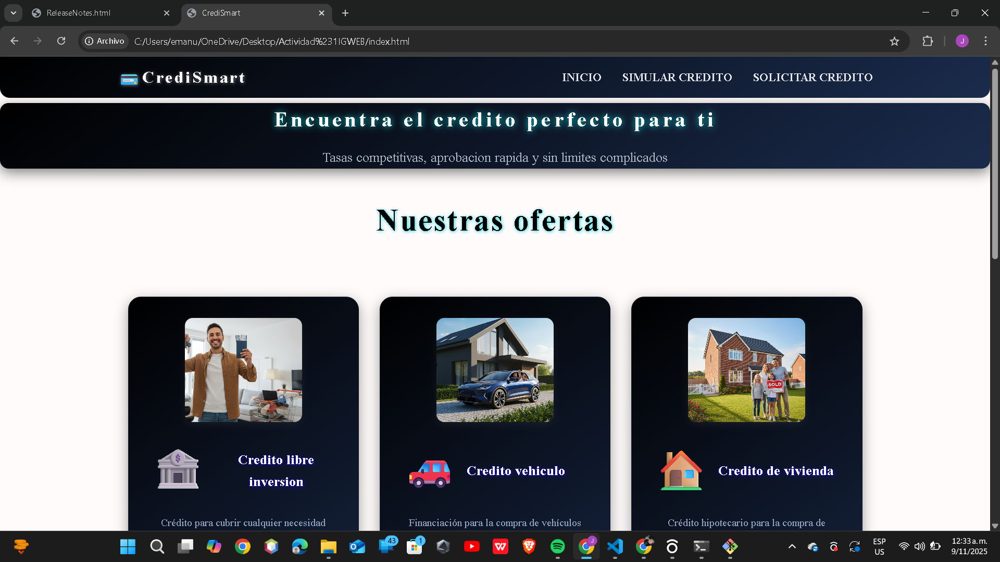
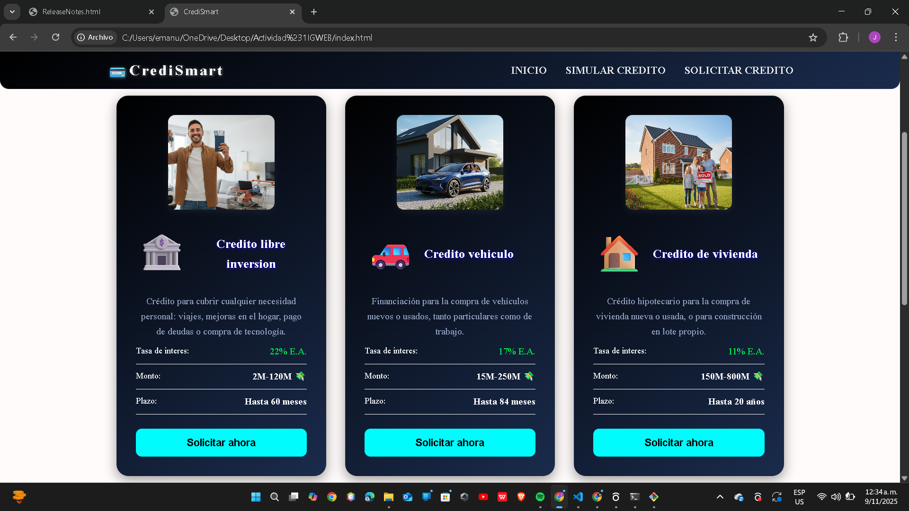
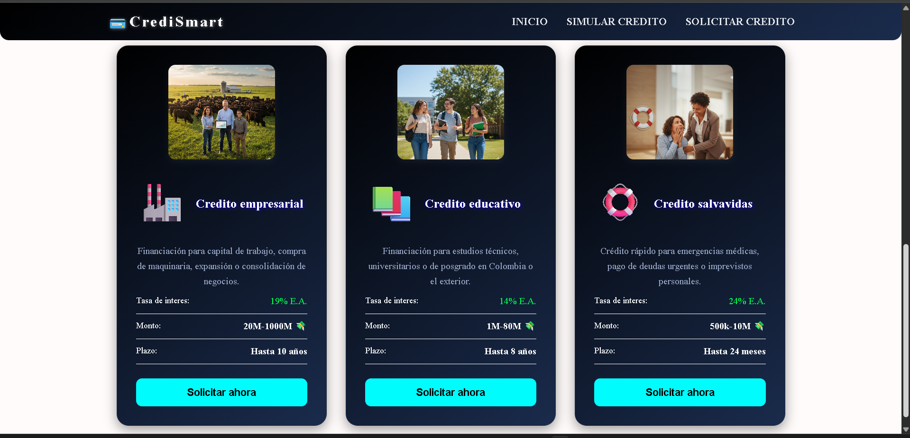
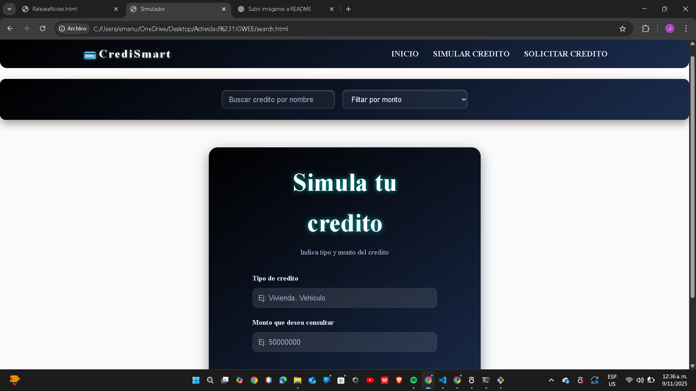
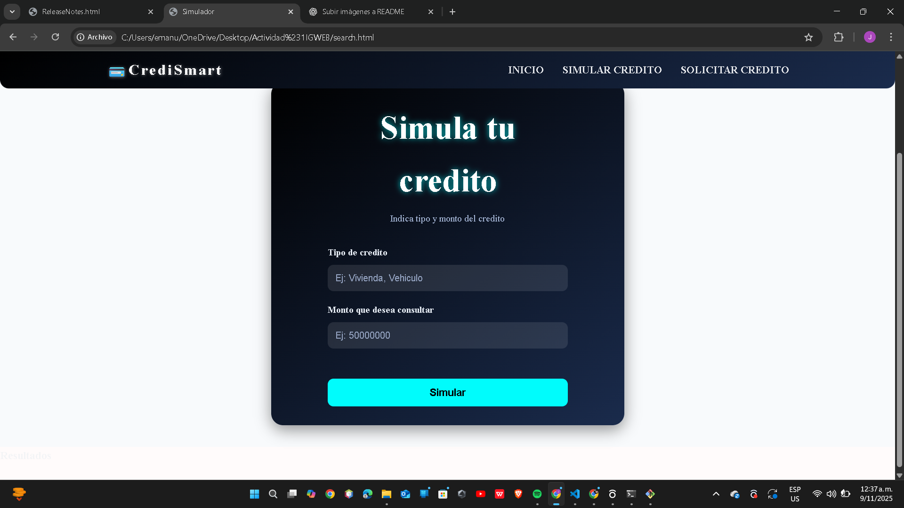
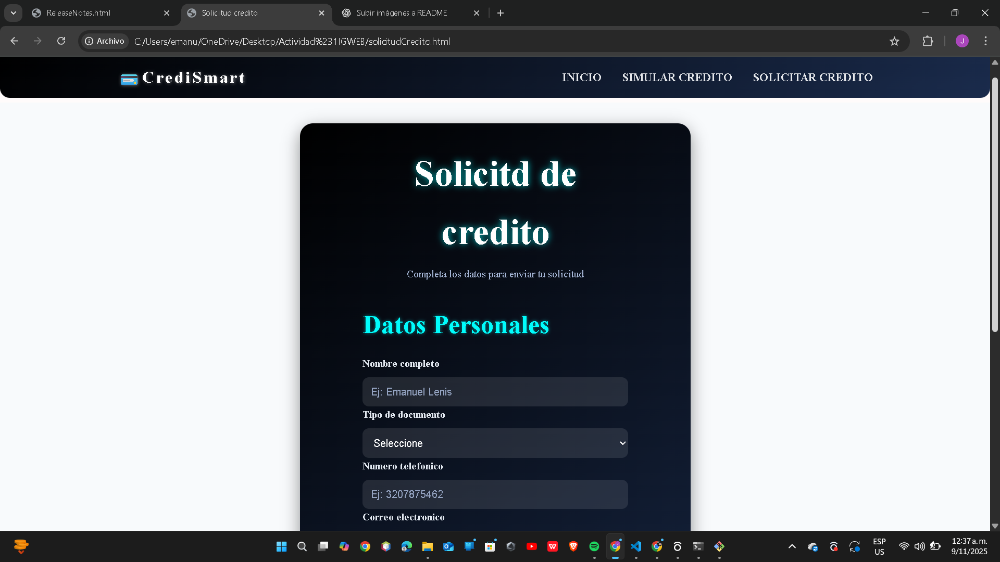
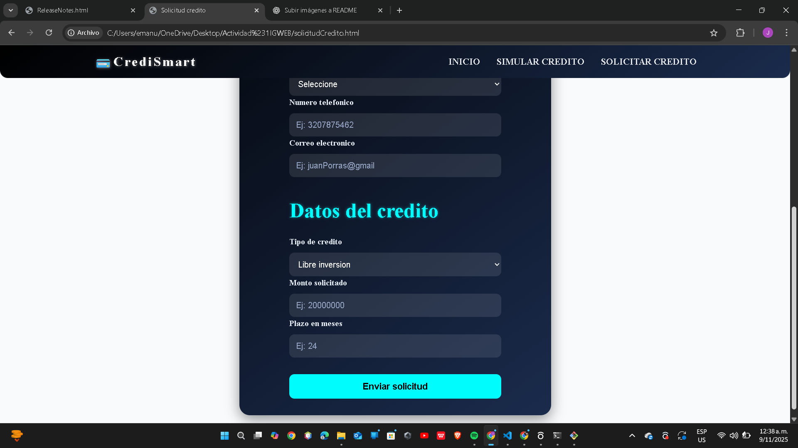

 💳 CrediSmart - Simulador de Crédito

Emanuel Alejandro Lenis Mesa

 Descripción
CrediSmart es una aplicación web que permite a los usuarios simular diferentes tipos de créditos (libre inversión, vivienda, vehículo, empresarial, educativo, etc.).  
El objetivo es ayudar al usuario a visualizar las cuotas mensuales, los intereses y los beneficios de cada opción de crédito según su necesidad.

 Funcionalidades
- Simulación de créditos con tasa de interés y plazo ajustable.  
- Cálculo de credito 
- Interfaz sencilla y moderna con HTML, CSS.  
- Opción para ver diferentes tipos de crédito con su descripción y beneficios.  

 Tecnologías utilizadas
- HTML5 → estructura del sitio  
- CSS → estilos y diseño visual  

la estructura del proyecto es: 

crediSmart
👇
index.html
search.html
solicitudCredito.html
style.css
imagenes 
readme.md

Instrucciones para abrirlo
clona el proyecto de mi repositorio haz clic en index.html

imagenes de las 3 paginas 

!
!
!

!
!

!
!